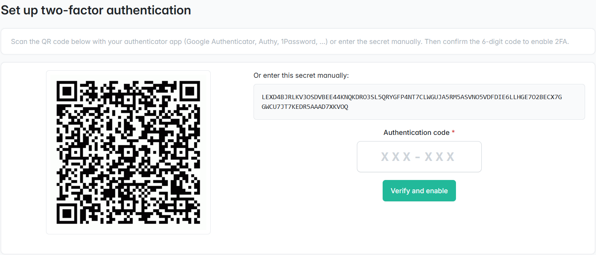
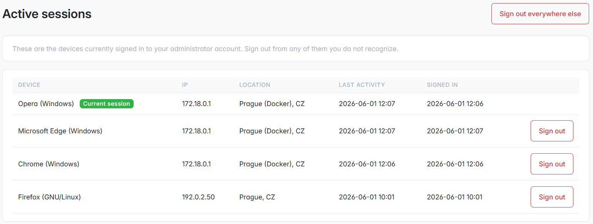
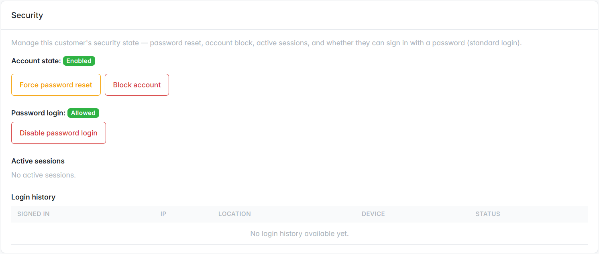
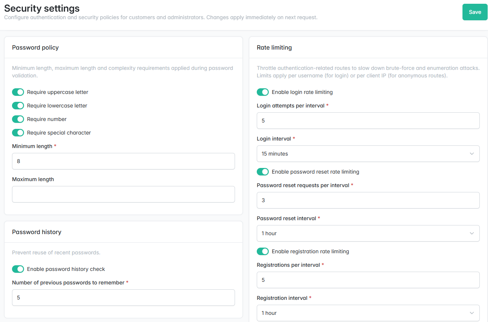

<p align="center">
    <a href="https://www.3brs.com" target="_blank">
        
    </a>
</p>
<h1 align="center">
    Enterprise Security Plugin
    <br />
    <a href="https://packagist.org/packages/3brs/sylius-enterprise-security-plugin" title="License" target="_blank">
        
    </a>
    <a href="https://packagist.org/packages/3brs/sylius-enterprise-security-plugin" title="Version" target="_blank">
        
    </a>
    <a href="https://github.com/3BRS/sylius-enterprise-security-plugin/actions" title="Build status" target="_blank">
        
    </a>
</h1>

## 3BRS Enterprise Security

- Password Policy
- Password History
- Password Expiration
- Password Change Notifications
- Two-Factor Authentication
- 3rd-party OAuth (Social Login)
- Magic Link Login
- Passkey Login (WebAuthn / FIDO2)
- Account Lockout & Rate Limiting
- Session Management & Login Notifications
- Centralized Security Settings UI
- Self-Service Account Deletion (GDPR)
- Admin IP Whitelist
- Admin IP Blacklist
- Admin Customer Management
- Per-User Password Login Control

<p align="center"></p>

<p align="center"></p>

<p align="center"></p>

<p align="center"></p>

## Features

Every feature ships **disabled by default** — enable and tune the ones you need (each linked doc covers its options and defaults).

| Feature | What it does | Doc |
| --- | --- | --- |
| Password Policy | Configurable password complexity (min/max length + uppercase / lowercase / number / special-character rules), separately per customer and admin group; overrides Sylius's weak 3-character default. | [password-policy](docs/password-policy.md) |
| Password History | Prevents reuse of recent passwords, with a configurable remembered count per group; customer and admin history stored separately. | [password-history](docs/password-history.md) |
| Password Expiration | Forces a password change after a configurable number of days, with an optional `force_change` on next login; independent for customers and admins. Existing accounts are measured from their creation date until the first change, so enabling it won't reset everyone at once. | [password-expiration](docs/password-expiration.md) |
| Password Change Notifications | Emails the user on every password change (account settings, forgot-password reset, admin-initiated) with the timestamp, IP address and a secure-account link. | [password-change-notifications](docs/password-change-notifications.md) |
| Two-Factor Authentication | TOTP 2FA (Google Authenticator, Authy, 1Password, …) with QR-code setup, single-use recovery codes, trusted devices and per-group `disabled` / `allowed` / `enforced` modes. Built on `scheb/2fa-bundle`. | [two-factor-authentication](docs/two-factor-authentication.md) |
| 3rd-party OAuth (Social Login) | Google, Apple and Microsoft sign-in per group, with account-link takeover protection, optional domain-gated auto-registration and an extensible provider registry. | [oauth-social-login](docs/oauth-social-login.md) |
| Magic Link Login | Passwordless email sign-in with single-use, hashed, time-limited tokens, anti-enumeration, timing-attack padding and rate limiting. As a passwordless method it bypasses 2FA (the second factor guards password login only). | [magic-link-login](docs/magic-link-login.md) |
| Passkey Login (WebAuthn / FIDO2) | Passwordless passkeys (Touch ID / Windows Hello / Android lock / hardware keys), multiple labelled keys per user, built on `web-auth/webauthn-lib`. As a passwordless method it bypasses 2FA (the second factor guards password login only). | [passkey-login](docs/passkey-login.md) |
| Account Lockout & Rate Limiting | Persistent per-user account lockout after N failed sign-ins (auto- or admin-unlock) plus ephemeral request rate limiting (login, password reset, registration, magic link). | [account-lockout-rate-limiting](docs/account-lockout-rate-limiting.md) |
| Session Management & Login Notifications | Active-session listing with manual revocation (single or all-other), plus optional email alerts on sign-in from a previously unseen device; pluggable GeoIP lookup. | [session-management-login-notifications](docs/session-management-login-notifications.md) |
| Centralized Security Settings UI | A single admin page (`/admin/security-settings`) to configure every feature at runtime — values persist in the database and apply on the next request, no YAML edits or redeploys. | [centralized-security-settings-ui](docs/centralized-security-settings-ui.md) |
| Self-Service Account Deletion (GDPR) | Customer-driven erasure (GDPR right to be forgotten) with a configurable grace period, admin-side cancellation and a cron that anonymizes name / email / phone / address. | [account-deletion-gdpr](docs/account-deletion-gdpr.md) |
| Admin IP Whitelist | Restrict admin-panel access to allowed IPs / CIDR ranges, with a team-wide global list plus optional per-admin lists. | [admin-ip-whitelist](docs/admin-ip-whitelist.md) |
| Admin IP Blacklist | Block specific IPs / CIDR ranges from the admin panel with a global deny-list — always wins over the whitelist, is identity-agnostic, and fails open when empty. | [admin-ip-blacklist](docs/admin-ip-blacklist.md) |
| Admin Customer Management | A Security section on the Sylius customer detail page — force password reset, block / unblock, sign out of all or individual sessions, plus active-sessions and login-history tables. | [admin-customer-management](docs/admin-customer-management.md) |
| Per-User Password Login Control | Disable email + password sign-in for individual customers or admins, forcing a stronger method (magic link, passkey or social login); per-group toggle plus a per-user switch with a lock-out guard. | [per-user-password-login-control](docs/per-user-password-login-control.md) |


## Installation (into an existing Sylius application)

This section is for **consuming** the plugin in your own Sylius project — you register the bundle/plugin and wire the config yourself. If you instead want to **work on the plugin itself**, skip to **Development** below: its bundled test application already has the bundle, plugin and routes registered, so you don't repeat these steps.

> **This plugin requires the standalone `3brs/enterprise-security-bundle` package and does not work without it.** The bundle is the framework-agnostic core (security validators, services, entity contracts); the plugin is the thin Sylius integration layer on top (admin / shop UI, controllers, routes, fixtures). That's why step 1 installs **both** packages (the bundle comes in as a dependency of the plugin) and step 2 registers them, and the entity traits in step 5 implement interfaces that live in the bundle.

> Every feature ships **disabled by default** (see each feature's doc under [`docs/`](docs/)). You enable only what you need in step 3, and the firewall / entity wiring in steps 5–6 is only required for the features you turn on.

1. Require the plugin (its standalone bundle and the Scheb 2FA bundle are pulled in automatically as dependencies):

   ```bash
   composer require 3brs/sylius-enterprise-security-plugin
   ```

2. Register the bundles in `config/bundles.php` (the plugin, its standalone bundle, and the Scheb 2FA bundle it builds on):

   ```php
   return [
       // ...
       Scheb\TwoFactorBundle\SchebTwoFactorBundle::class => ['all' => true],
       ThreeBRS\EnterpriseSecurityBundle\ThreeBRSEnterpriseSecurityBundle::class => ['all' => true],
       ThreeBRS\SyliusEnterpriseSecurityPlugin\ThreeBRSSyliusEnterpriseSecurityPlugin::class => ['all' => true],
   ];
   ```

3. Import the plugin configuration and enable the features you want by creating `config/packages/threebrs_sylius_enterprise_security_plugin.yaml`:

   ```yaml
   imports:
       - { resource: "@ThreeBRSSyliusEnterpriseSecurityPlugin/Resources/config/config.yaml" }

   three_brs_sylius_enterprise_security:
       # Turn on and tune the features you need — each feature's doc under
       # docs/ documents its options and defaults (everything is off by default).
   ```

4. Import the plugin routes by creating `config/routes/three_brs_enterprise_security.yaml` (without this none of the plugin endpoints — passkey, magic link, 2FA setup, OAuth, account deletion, settings UI — are registered):

   ```yaml
   three_brs_enterprise_security:
       resource: "@ThreeBRSSyliusEnterpriseSecurityPlugin/Resources/config/routes.yaml"
   ```

5. Add the relevant traits to your `ShopUser` and `AdminUser` entities. Include **only** the traits for the features you enabled — `PasswordExpiration*` (Password Expiration), `TwoFactorAuth*` (Two-Factor Authentication), `Lockable*` (Account Lockout), `PasswordLoginControl*` (Per-User Password Login Control, admin only). (Password Expiration also reads the account creation date via `getCreatedAt()` as its fallback for users who have never changed their password — Sylius's base `ShopUser` / `AdminUser` already expose it, so no extra wiring is needed here.) The full set:

   ```php
   // src/Entity/User/ShopUser.php
   use Sylius\Component\Core\Model\ShopUser as BaseShopUser;
   use ThreeBRS\EnterpriseSecurityBundle\Lockout\LockableShopUserInterface;
   use ThreeBRS\EnterpriseSecurityBundle\PasswordExpiration\PasswordExpirationShopUserInterface;
   use ThreeBRS\EnterpriseSecurityBundle\TwoFactor\TwoFactorAuthShopUserInterface;
   use ThreeBRS\SyliusEnterpriseSecurityPlugin\Model\LockableShopUserTrait;
   use ThreeBRS\SyliusEnterpriseSecurityPlugin\Model\PasswordExpirationShopUserTrait;
   use ThreeBRS\SyliusEnterpriseSecurityPlugin\Model\TwoFactorAuthShopUserTrait;

   class ShopUser extends BaseShopUser implements PasswordExpirationShopUserInterface, TwoFactorAuthShopUserInterface, LockableShopUserInterface
   {
       use PasswordExpirationShopUserTrait;
       use TwoFactorAuthShopUserTrait;
       use LockableShopUserTrait;
   }
   ```

   ```php
   // src/Entity/User/AdminUser.php
   use Sylius\Component\Core\Model\AdminUser as BaseAdminUser;
   use ThreeBRS\EnterpriseSecurityBundle\Lockout\LockableAdminUserInterface;
   use ThreeBRS\EnterpriseSecurityBundle\PasswordExpiration\PasswordExpirationAdminUserInterface;
   use ThreeBRS\EnterpriseSecurityBundle\TwoFactor\TwoFactorAuthAdminUserInterface;
   use ThreeBRS\SyliusEnterpriseSecurityPlugin\Model\LockableAdminUserTrait;
   use ThreeBRS\SyliusEnterpriseSecurityPlugin\Model\PasswordExpirationAdminUserTrait;
   use ThreeBRS\SyliusEnterpriseSecurityPlugin\Model\PasswordLoginControlAdminUserInterface;
   use ThreeBRS\SyliusEnterpriseSecurityPlugin\Model\PasswordLoginControlAdminUserTrait;
   use ThreeBRS\SyliusEnterpriseSecurityPlugin\Model\TwoFactorAuthAdminUserTrait;

   class AdminUser extends BaseAdminUser implements PasswordExpirationAdminUserInterface, TwoFactorAuthAdminUserInterface, LockableAdminUserInterface, PasswordLoginControlAdminUserInterface
   {
       use PasswordExpirationAdminUserTrait;
       use TwoFactorAuthAdminUserTrait;
       use LockableAdminUserTrait;
       use PasswordLoginControlAdminUserTrait;
   }
   ```

   > Magic link, passkey, OAuth, session management, login notifications and account deletion keep their data in their own tables (foreign-keyed to `ShopUser` / `AdminUser`) and need **no** traits.

6. Configure the firewall for the features you enabled, in `config/packages/security.yaml` (and `config/packages/scheb_2fa.yaml` for 2FA). Each feature's doc under `docs/` contains the exact block to copy:
   - **Two-Factor Authentication** — the `scheb_2fa.yaml` config, the shop `success_handler`, and the `two_factor` blocks on the `shop` / `admin` firewalls.
   - **3rd-party OAuth**, **Magic Link Login**, **Passkey Login** — the `PUBLIC_ACCESS` `access_control` entries that expose their login endpoints.

7. Update the database schema to create the plugin tables (`three_brs_*`) and the trait columns added in step 5:

   ```bash
   bin/console doctrine:schema:update --complete --force
   ```

   In production generate and run a migration with your usual workflow instead.

8. Install the bundled assets (e.g. the passkey browser script):

   ```bash
   bin/console assets:install
   ```

## Troubleshooting

### `Cannot create union with both "object" and class type` during cache clear / warmup

If `bin/console cache:clear` (or any route / API metadata warmup) fails with:

```
Cannot create union with both "object" and class type.
```

this is an **upstream api-platform regression, not a plugin bug**. API Platform's property-metadata scanner (Symfony's `PhpStanExtractor` → `TypeInfo`) chokes on generic `@template T of object` PHPDoc present in some of the plugin's transitive dependencies (e.g. `web-auth/webauthn-lib`), trying to build an `object|SomeClass` union that `TypeInfo` rejects. Because API Platform is enabled by default in Sylius 2, you hit it right after installing the plugin.

It affects api-platform `4.3.x` (reproduced on 4.3.5–4.3.7; no fixed release exists at the time of writing). Until an upstream fix ships, work around it by decorating the property-info extractors with a wrapper that swallows the `TypeInfo` exception.

Add the decorator class to your application — use the plugin's [`SafePhpStanExtractor`](tests/Application/src/PropertyInfo/SafePhpStanExtractor.php) as a reference implementation. It implements every property-info extractor interface (on Symfony 7.3+ also `ConstructorArgumentTypeExtractorInterface`) and returns `null` whenever the inner extractor throws `Symfony\Component\TypeInfo\Exception\InvalidArgumentException`. Then register it over both Symfony's and API Platform's extractor services:

```yaml
# config/services.yaml
services:
    App\PropertyInfo\SafePhpStanExtractor:
        arguments: { $inner: '@.inner' }
        decorates: property_info.phpstan_extractor
        decoration_on_invalid: ignore

    app.property_info.safe_php_doc_extractor:
        class: App\PropertyInfo\SafePhpStanExtractor
        arguments: { $inner: '@.inner' }
        decorates: property_info.php_doc_extractor
        decoration_on_invalid: ignore

    app.property_info.safe_reflection_extractor:
        class: App\PropertyInfo\SafePhpStanExtractor
        arguments: { $inner: '@.inner' }
        decorates: property_info.reflection_extractor
        decoration_on_invalid: ignore

    # API Platform registers its own parallel extractor services — decorate those too:
    app.property_info.api_platform_safe_phpstan_extractor:
        class: App\PropertyInfo\SafePhpStanExtractor
        arguments: { $inner: '@.inner' }
        decorates: api_platform.property_info.phpstan_extractor
        decoration_on_invalid: ignore

    app.property_info.api_platform_safe_php_doc_extractor:
        class: App\PropertyInfo\SafePhpStanExtractor
        arguments: { $inner: '@.inner' }
        decorates: api_platform.property_info.php_doc_extractor
        decoration_on_invalid: ignore

    app.property_info.api_platform_safe_reflection_extractor:
        class: App\PropertyInfo\SafePhpStanExtractor
        arguments: { $inner: '@.inner' }
        decorates: api_platform.property_info.reflection_extractor
        decoration_on_invalid: ignore
```

> The decorator is harmless once the upstream bug is fixed (it only catches an exception that no longer fires), but remove it after you upgrade to a fixed api-platform release to keep your container clean.

## Development

This section is **only** for contributing to / developing the plugin — not for installing it into your own app (that's the *Installation* section above). The bundled **test application** under [`tests/Application/`](./tests/Application/) already has the bundle, plugin, routes and feature config registered (it's part of this repo), so you do **not** repeat the Installation steps — `make init` brings the whole stack up ready to go.

### Usage

- Develop the plugin in `/src`; the framework-agnostic core lives in the separate [`3brs/enterprise-security-bundle`](https://packagist.org/packages/3brs/enterprise-security-bundle) package (its own repository)
- See [`bin/`](./bin) and [`Makefile`](./Makefile) for useful commands

### Bootstrapping the dev environment

Spin up the dockerized test application (DB, PHP, assets, migrations, fixtures wiring) in one go:

```bash
make init
```

This builds the containers, runs `composer install`, creates the database, applies all migrations (including the plugin's `three_brs_*_social_account_link` tables) and builds the frontend assets. Use `make init-tests` for the `test` environment.

In the dev environment both Google and Apple OAuth providers are swapped for a fake in-memory provider (see [`tests/Application/config/services_dev.yaml`](./tests/Application/config/services_dev.yaml)) so the social-login buttons work end-to-end without any external credentials. To exercise the real Google/Apple flows locally, comment out the `FakeOAuthProvider` override and fill in your credentials in `tests/Application/.env.local`.

### Testing

After your changes you must ensure that the tests are still passing.

```bash
make ci
```

## License

MIT License. See [LICENSE](./LICENSE) for details.

## Credits

Developed by [3BRS](https://3brs.com)
